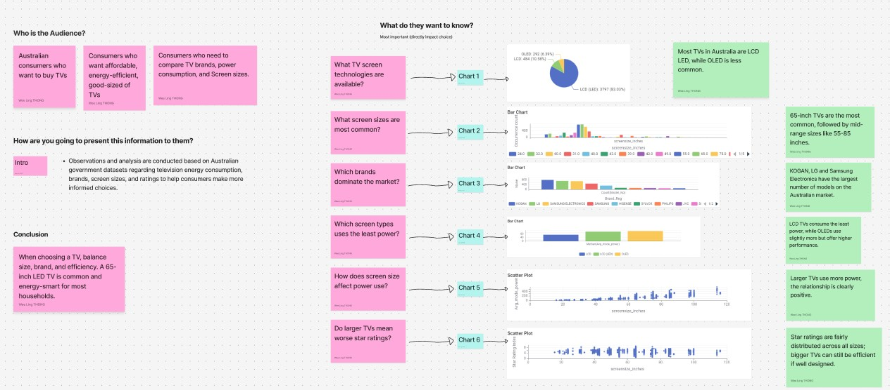

# Appliance-Energy-Consumption-Website
COS30045 DATA VISUALISATION T01, 02, 03

An educational single-page web application demonstrating household appliance energy consumption in the Australian market, with a focus on television efficiency data processed via KNIME.

## Project Details
- **Author:** Wee Ling THONG
- **Student ID:** 102789000
- **Unit:** COS30045 - Data Visualisation
- **Live Demo (Vercel):** https://appliance-energy-consumption-websit-tau.vercel.app/index.html

---

## Features & Requirements Compliance
- **Three Pages:** Home, Televisions, and About Us.
- **JavaScript Navigation:** Smooth view swapping without full page reloads, using standard DOM manipulation and HTML5 History API.
- **Power Logo:** Logo position in the top left corner, with click event handler to return to the Home page.
- **User Feedback:** Hover feedback on navbar items and active state highlighting for the current page.
- **CSS Styling:** Color scheme matching the yellow power logo theme (`#FFD000` / dark background).
- **Data Integration:** Displays visualisations generated from the 2026 Energy Rating Data for household appliances – Televisions dataset via KNIME.

---

## How to Run Locally
1. Clone or download this repository.
2. Open `index.html` using a local web server (e.g., VS Code **Live Server** extension) to ensure full JavaScript and History API functionality.

---

## Insights and Reflections on Using GitHub Copilot / Generative AI

### Application of GitHub Copilot / Generative AI
- **Initial Code and HTML Structure:** Used AI assistance to draft the semantic HTML5 scaffold (navigation, sections, footer).
- **CSS Layout and Styling:** Used Gemini/Generative AI for suggestions on conceptualizing the webpage layout and color scheme.
- **JavaScript SPA Logic:** Used AI to help write the logic for Single-Page Application (SPA) navigation (the `navigateTo` function) and event listeners for managing "active states" (active classes).

### Experience and Reflections
Using GitHub Copilot and generative AI tools significantly accelerated the initial setup and layout phases of the project. When I encountered challenges regarding layout or color schemes, these AI tools provided suggestions and design ideas, allowing me to focus more energy on data cleaning in KNIME and ensuring the website's responsiveness. Although the AI ​​provided useful code snippets and recommendations, I consistently reviewed, optimized, and tested all generated code to ensure functionality and strict adherence to the project's specific requirements. Through this process, I deepened my understanding of DOM manipulation, CSS Grid layout, and JavaScript event handling mechanisms.

---

## Data Story & Target Audience (T03)

### 1. Who is the Audience?
The primary audience for this interactive visualization website is **Australian consumers** planning to purchase a new television. Specifically, this includes:
- Consumers looking for affordable, energy-efficient, and appropriately sized TVs.
- Consumers who need to compare TV brands, power consumption, and screen sizes to make an informed decision.

### 2. How is this Information Presented?
**Introduction / Context:**
Observations and analysis are conducted based on the Australian government dataset regarding television energy consumption, registered brands, screen sizes, and energy star ratings. The visual narrative guides consumers step-by-step from general market availability to specific power efficiency comparisons, enabling more informed purchasing choices.

### 3. What do they want to know? (Story Structure & Visualizations)

#### Part 1: Market Availability & Options
* **What TV screen technologies are available?**
  * **Visual:** Chart 1 (Display Technology Distribution)
  * **Insight:** Most TVs available in Australia are LCD LED, while OLED accounts for a smaller, premium segment.
* **What screen sizes are most common?**
  * **Visual:** Chart 2 (Screen Size Distribution)
  * **Insight:** 65-inch TVs are the most common in the market, followed by mid-range sizes between 55 and 85 inches.
* **Which brands dominate the market?**
  * **Visual:** Chart 3 (Brand Model Counts)
  * **Insight:** KOGAN, LG, and Samsung Electronics offer the largest number of TV models in the Australian market.

#### Part 2: Energy Consumption & Efficiency Analysis
* **Which screen types use the least power?**
  * **Visual:** Chart 4 (Power Consumption by Screen Type)
  * **Insight:** LCD TVs consume the least power overall, while OLED TVs consume slightly more due to higher performance display capabilities.
* **How does screen size affect power use?**
  * **Visual:** Chart 5 (Power Consumption vs. Screen Size)
  * **Insight:** Larger screen sizes directly correlate with higher energy consumption, showing a clear positive relationship.
* **Do larger TVs mean worse star ratings?**
  * **Visual:** Chart 6 (Energy Star Rating vs. Screen Size)
  * **Insight:** Energy star ratings are fairly distributed across all screen sizes, indicating that larger TVs can still be energy-efficient if properly engineered.

### 4. Key Takeaways & Conclusion
When choosing a TV in Australia, consumers should balance screen size, brand reliability, and power efficiency. For most average households, a **65-inch LCD LED TV** represents the sweet spot for availability, screen real estate, and energy efficiency.

---

## Storyboard

---

## About the Data

- **Data Source:** Australian Government Dataset ([data.gov.au](https://data.gov.au/)) Energy Rating Data for household appliances – Labelled Product Televisions.
- **Data Processing:** Cleaned, filtered, and aggregated using the KNIME Analytics Platform (e.g., removing duplicate models, categorizing brands, and standardizing screen size measurements).
- **Privacy:** The dataset contains publicly available product registration data from manufacturers; no personal, private, or user-identifiable data is involved.
- **Accuracy & Limitations:** The dataset reflects officially registered appliance models in Australia up to 2026. Limitations include potential variations in actual household energy usage depending on non-standard viewing environments, custom brightness settings, and daily usage hours.
- **Ethics:** The data is used strictly for non-commercial, educational purposes to help consumers increase energy transparency and make eco-friendly purchasing choices.

## AI Declaration
Generative AI tools (e.g., ChatGPT/Gemini) were used as a learning assistant to help with initial code and HTML structure, JavaScript SPA Logic, format Markdown documentation, suggestion idea of CSS layout styles, and refine language clarity for the data story. 

All KNIME data processing workflows, node configurations, and charts were created by the author by following the unit's lab instructions and lecture materials. All AI-assisted web code was throughly reviewed, tested, and to have a full understanding.
